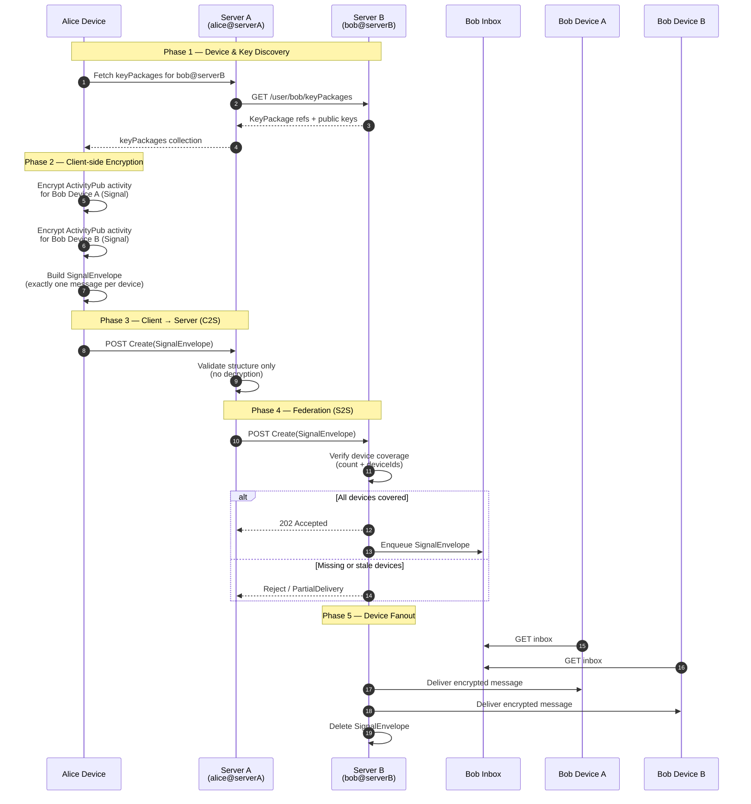
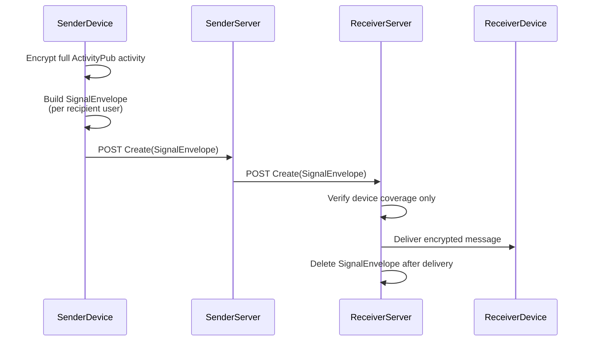
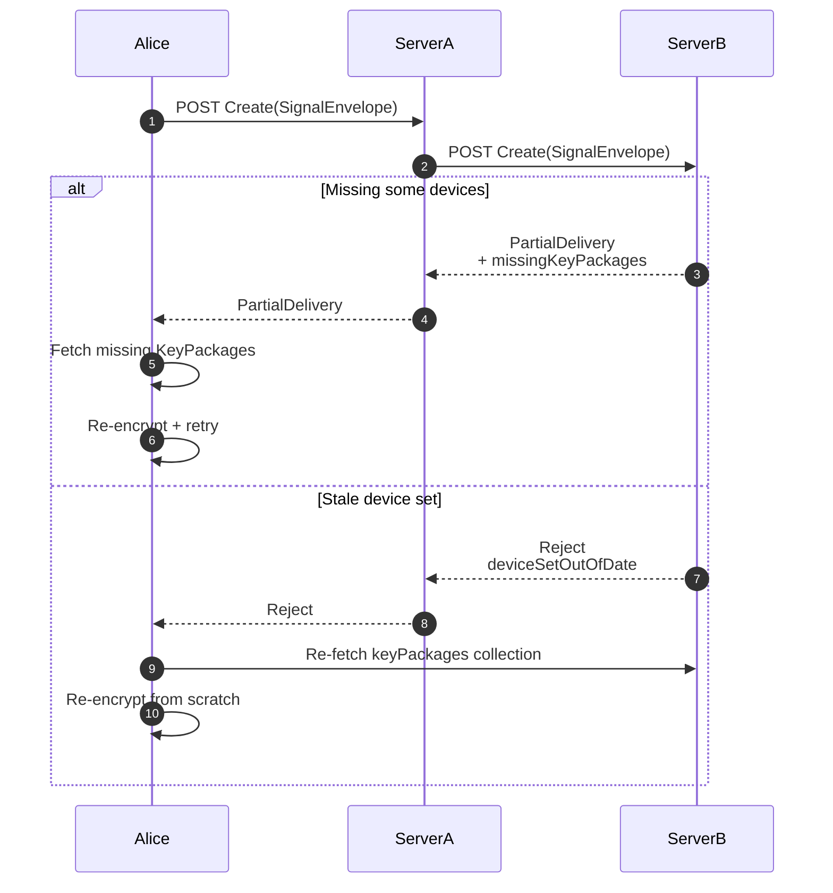
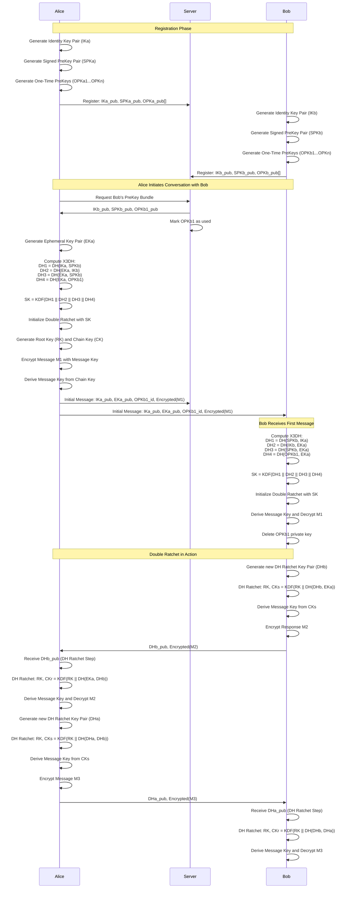
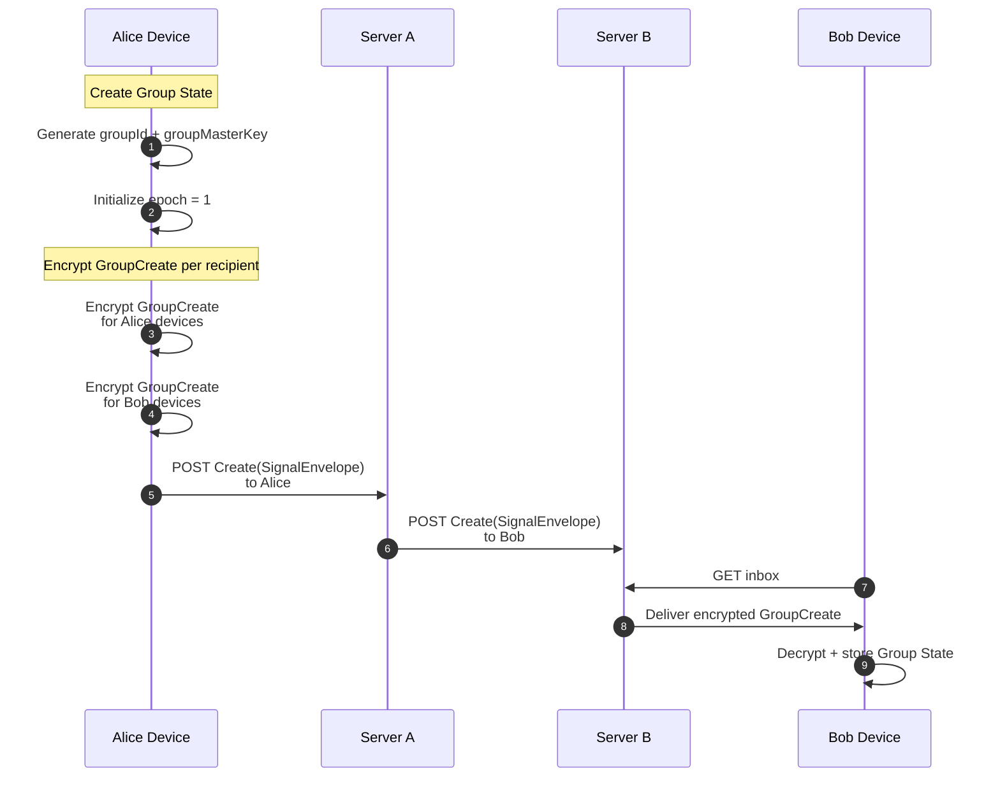
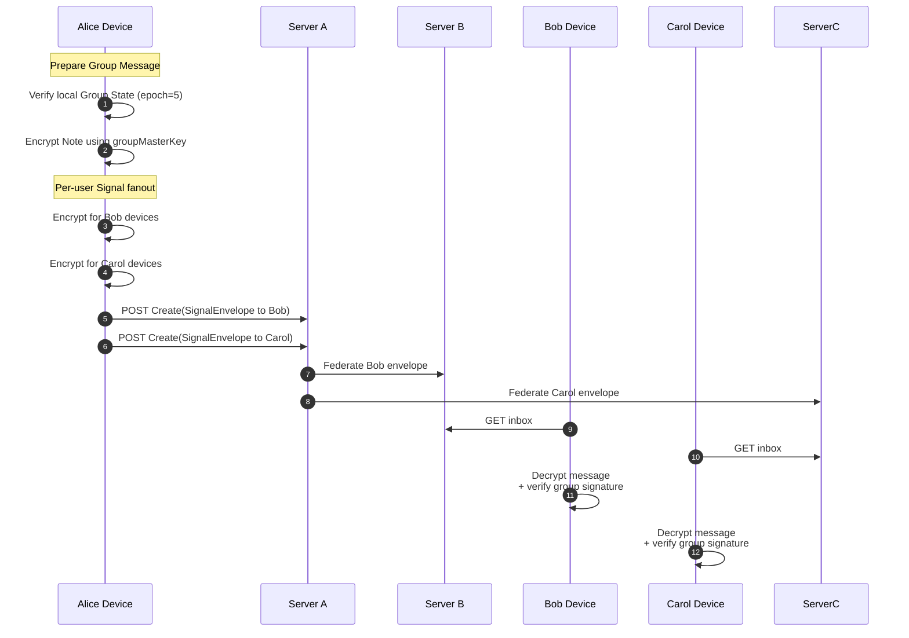
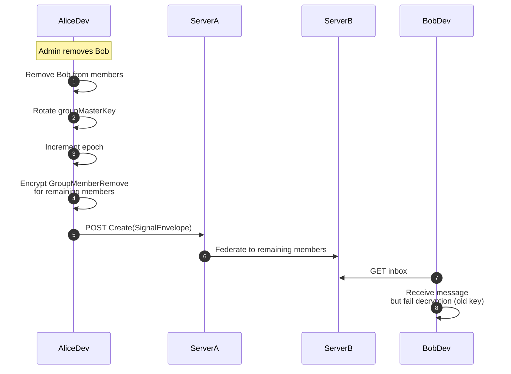
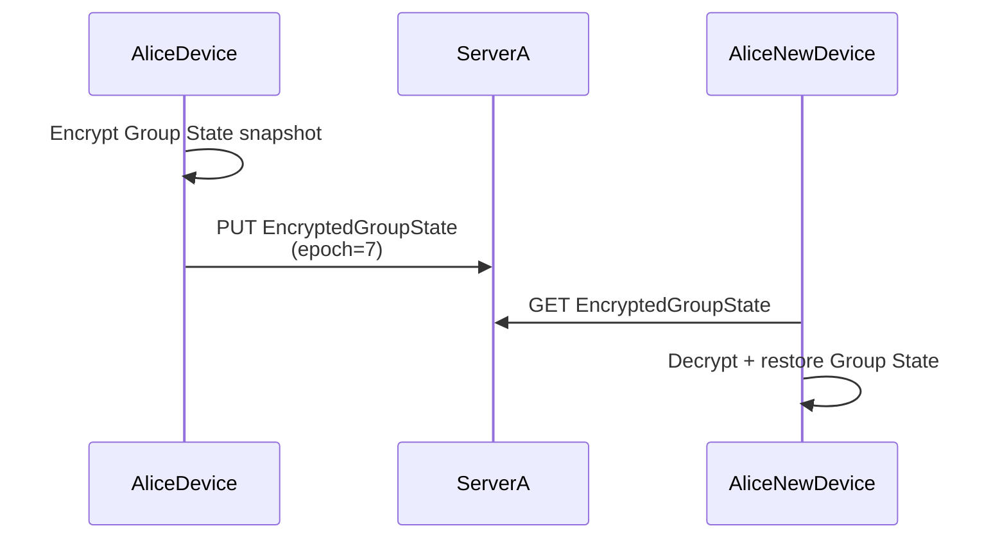

# General Protocol

## Sending a message

## SignalEnvelope Lifecycle

## Partial Delivery / Reject

## Signal Protocol

# Groups

## Group Creation

## Sending a Group Message

## Group Member Removal

## Encrypted Group State Upload

