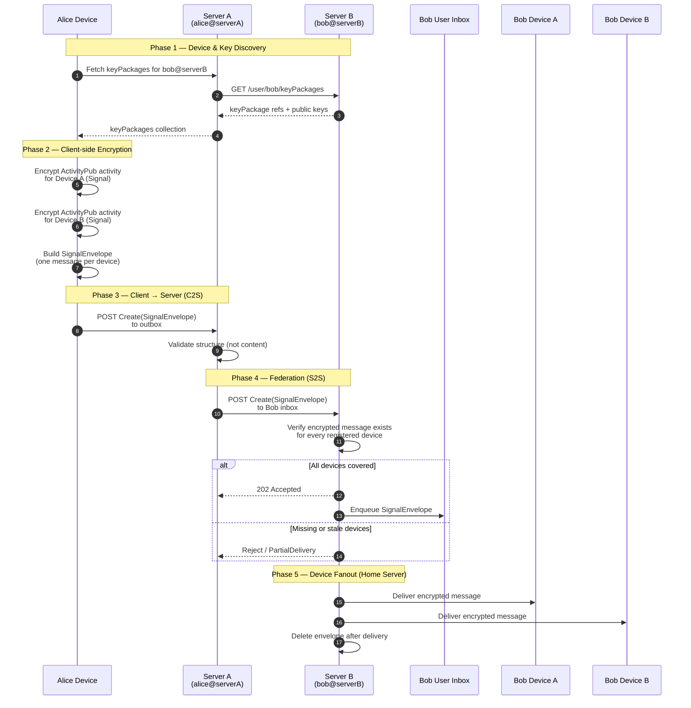

# WIP: Eko Messages
A standalone, end-to-end encrypted (E2EE) messaging application.

This repository contains the backend server for Eko Messenger, a standalone, end-to-end encrypted (E2EE) messaging application that uses the Eko Social app for authentication.

The server is written in Rust and uses the ActivityPub protocol for federation. While this server powers the Eko Messenger application, it also serves as a reference implementation for a secure, E2EE messaging protocol over ActivityPub.

# [Specification](https://github.com/eko-network/eko-messenger/blob/main/README.md)
The specification is found [here](https://github.com/eko-network/eko-messenger/blob/main/README.md)

# Example

## Sending a message

## SignalEnvelope Lifecycle

## Partial Delivery / Reject

## Signal Protocol

